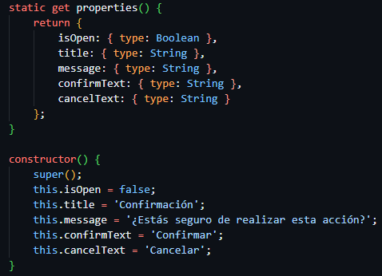
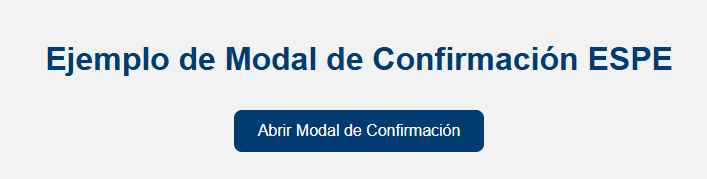
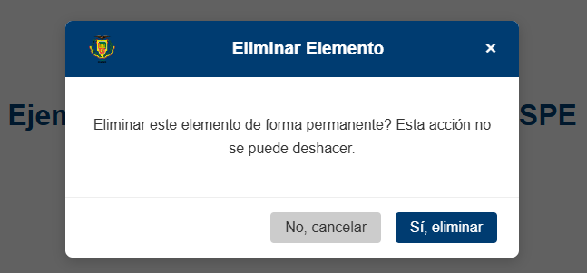
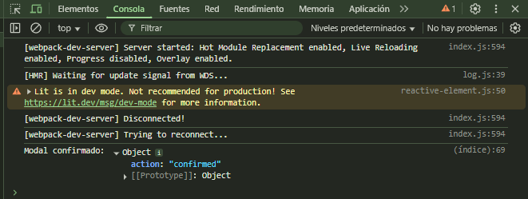

# Modal de Confirmación Personalizado — LitElement + ESPE

**Nombre:** DARWIN ANDRES TOAPANTA PAEZ  
**Docente:** PAULO CESAR GALARZA SANCHEZ 
**Componente:** `<espe-confirm-modal>`  
**Rama:** `tarea2-personalizar-comportamientos`  

---

## 🎯 Objetivo

Personalizar el comportamiento de un Web Component utilizando **LitElement**, integrando:

- Estados dinámicos (@property)
- Temas y estilos alineados al manual de identidad de ESPE
- Eventos personalizados para la comunicación entre componentes
- Buenas prácticas de desarrollo evitando patrones generados por IA

---
## ✅ Manejo de propiedades reactivas

En este proyecto **no se utilizaron decoradores `@property`** para definir las propiedades reactivas del componente.

En su lugar, se implementó el método estático clásico `static get properties()` que retorna un objeto con las propiedades del componente y sus tipos.

Este patrón es recomendado para mantener compatibilidad y claridad en el código.

<p align="center">
  
</p>

---

## 🧩 Descripción del Componente

`<espe-confirm-modal>` es un componente web reutilizable que muestra un **modal de confirmación**, como pide en la tarea, 
ideal para acciones críticas como eliminar elementos.

El diseño respeta los lineamientos visuales solicitados por le ingeniero dentro de la tarea:  
✅ Azul primario `#003C71`  
✅ Tipografía Roboto/Arial  
✅ Espaciados institucionales  

El componente es **accesible** y **reacciona dinámicamente** a los atributos pasados.

---

## 🛠️ Uso

### HTML
```html
<espe-confirm-modal
  id="myConfirmModal"
  title="Eliminar Elemento"
  message="¿Realmente deseas eliminar este elemento?"
  confirmText="Sí, eliminar"
  cancelText="No, cancelar">
</espe-confirm-modal>

<button id="openModalButton">Abrir Modal</button>
```
---

## Eventos Personalizados
El componente emite eventos personalizados para notificar acciones y permitir la comunicación con otros elementos o la lógica de la aplicación:
modal-confirmado:

- Se dispara cuando el usuario hace clic en el botón de "Confirmar".
- Contiene detail: { action: 'confirmed' }.
- Aplicación de Comunicación Intercomponente: Permite que el componente padre (o cualquier elemento que escuche este evento) ejecute una acción específica tras la confirmación del usuario, desacoplando la lógica del modal de la acción a realizar.

modal-cancelado:

- Se dispara cuando el usuario hace clic en el botón de "Cancelar" o en el botón de cierre (&times;), o presiona la tecla Escape.
- Contiene detail: { action: 'canceled' }.
- Aplicación de Comunicación Intercomponente: Similar a modal-confirmado, permite que la aplicación reaccione a la cancelación por parte del usuario.

## 💻 Personalización de Estados Dinámicos

En este proyecto, el componente <espe-confirm-modal> utiliza un estado dinámico principal llamado isOpen que controla la visibilidad del modal. Este estado es reactivo y al cambiar su valor, el componente se actualiza automáticamente para mostrar u ocultar el modal en la interfaz.

## ⚙️ Ventajas de LitElement frente a JavaScript puro

- Simplifica la creación de Web Components con manejo automático de propiedades reactivas.
- Permite encapsular estilos y templates de forma clara y organizada.
- Mejora el rendimiento con actualizaciones eficientes al DOM.
- Facilita la reutilización y mantenimiento del código.
- Integra soporte nativo para plantillas declarativas y eventos personalizados.

## 👍Validación y Accesibilidad

- Se implementaron atributos `aria-label`, `role="dialog"`, y soporte para teclado con `tabindex` y escucha de tecla Escape para cerrar el modal.
- Esto mejora la accesibilidad para usuarios con lectores de pantalla y facilita la navegación por teclado.
- No se implementaron validaciones de formulario en este componente porque es un modal de confirmación simple.


## 📁 Estructura del Proyecto
├── components/
│   └── espe-confirm-modal.js
├── node_modules/
├── index.html
├── package-lock.json
├── package.json
├── webpack.config.js
└── README.md

##  🏁 Ejecución del proyecto

A continuación se muestra la evidencia visual del componente en funcionamiento:

### 🔹 Página principal del proyecto
Se visualiza un botón que abre el modal de confirmación personalizado.

<p align="center">
  
</p>

---

### 🔹 Modal de confirmación activo
Al hacer clic en el botón, se muestra el modal con diseño institucional, encabezado con el logo de la ESPE y los botones de acción.

<p align="center">
  
</p>

---

### 🔹 Consola del navegador
Se evidencian los eventos personalizados `modal-confirmado` y `modal-cancelado`, lo cual demuestra la correcta comunicación entre el componente y su entorno.

<p align="center">
  
</p>